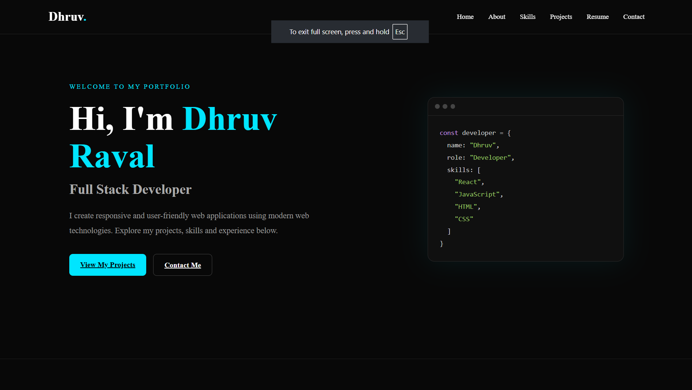
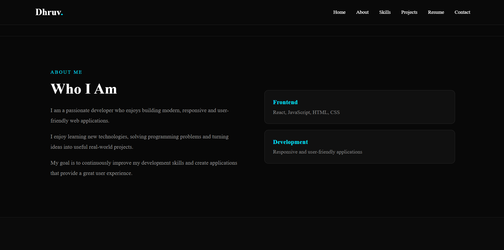
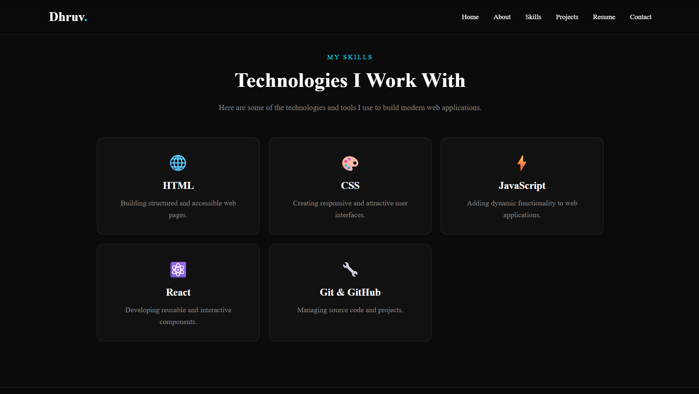
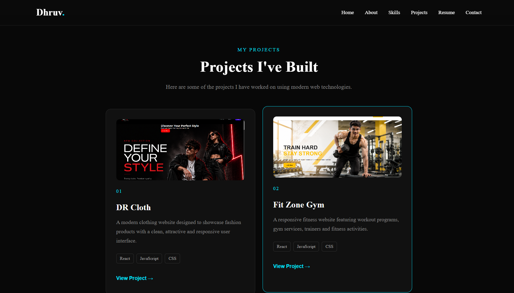
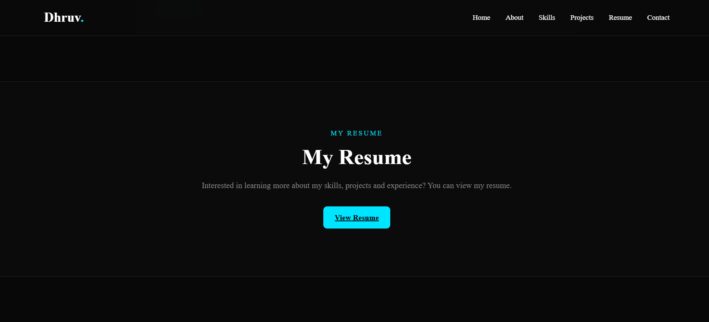
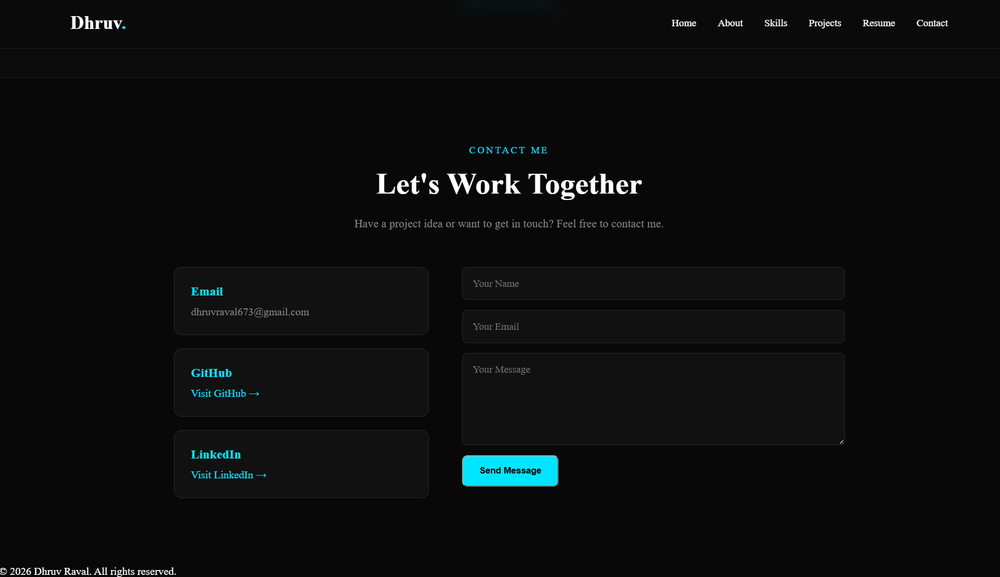

# 🌐 Dhruv Raval --- Personal Portfolio

A modern, responsive personal portfolio website built with **React.js**
and **Vite**.

## ✨ Features

-   🏠 Home / Hero section
-   👤 About Me
-   🛠️ Skills
-   💻 Projects
-   📄 Resume with PDF viewer
-   📩 Contact section
-   🔗 GitHub and LinkedIn links
-   📱 Responsive design
-   ⚡ React lazy loading
-   🖼️ Lazy-loaded project images
-   🚀 Optimized Vite production build

## 💻 Projects

### DR Cloth

A modern clothing and fashion website with a clean, responsive
interface.

### Fit Zone Gym

A responsive fitness and gym website with workout categories and trainer
sections.

## 🛠️ Technologies

-   React.js
-   JavaScript
-   HTML5
-   CSS3
-   Vite
-   Git & GitHub

## 📁 Project Structure

``` text
my-portfolio/
├── public/
│   └── resume.pdf
├── screenshots/
│   ├── home.png
│   ├── about.png
│   ├── skills.png
│   ├── projects.png
│   ├── resume.png
│   └── contact.png
├── src/
│   ├── assets/
│   │   ├── dr-cloth.png
│   │   └── fit-zone.png
│   ├── components/
│   ├── App.jsx
│   ├── App.css
│   └── main.jsx
├── package.json
└── README.md
```

## 📸 Screenshots

### Home



### About Me



### Skills



### Projects



### Resume



### Contact



## ⚡ Performance Optimization

Major sections are lazy-loaded using React:

``` jsx
const About = lazy(() => import("./components/About"));
const Skills = lazy(() => import("./components/Skills"));
const Projects = lazy(() => import("./components/Projects"));
const Resume = lazy(() => import("./components/Resume"));
const Contact = lazy(() => import("./components/Contact"));
```

Project images use browser lazy loading:

``` jsx

```

Vite also minifies the JavaScript and CSS during the production build.

## 💻 Installation

``` bash
git clone <YOUR-GITHUB-REPOSITORY-URL>
cd my-portfolio
npm install
```

## ▶️ Run Locally

``` bash
npm run dev
```

## 📦 Production Build

``` bash
npm run build
npm run preview
```

The production files are generated in the `dist/` folder.

## 🌍 Deployment

This project can be deployed using Vercel, Netlify, or GitHub Pages.

**Live Website:** `<YOUR-LIVE-PORTFOLIO-URL>`

## 🧪 Testing

The project was tested for responsive layout, navigation, project
images, resume link, contact links, production build, and local
production preview.

## 🧩 Challenges & Solutions

**Responsive navigation:** Used CSS media queries for smaller screens.

**Large project images:** Added lazy loading to improve initial page
loading.

**Performance:** Used React `lazy()` and `Suspense` to split sections
into separate JavaScript chunks.

**Production build:** Configured Vite build and preview scripts and
verified the production build locally.

## 🔮 Future Improvements

-   Add a backend for the contact form
-   Add project demo links
-   Add more projects
-   Add animations
-   Connect a custom domain

## 📬 Contact

**Email:** dhruvraval673@gmail.com

**GitHub:** `<YOUR-GITHUB-PROFILE-URL>`

**LinkedIn:** `<YOUR-LINKEDIN-PROFILE-URL>`

## 👨‍💻 Author

**Dhruv Raval**\
Full Stack Developer
